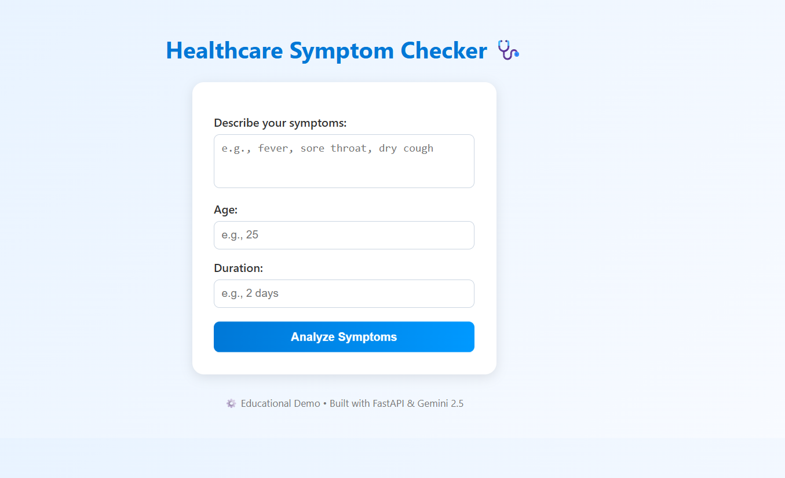

# 🩺 Healthcare Symptom Checker

An **AI-powered healthcare assistant** built using **FastAPI** and **Google Gemini 2.5**, which analyzes user symptoms and provides **possible medical conditions** and **recommended next steps** for **educational purposes only**.

> ⚠️ *This project does not provide medical advice. It is strictly for learning and demonstration.*

---

## 🌟 Features

✅ Accepts symptoms, age, and duration from user input  
✅ Queries **Gemini 2.5 API** for reasoning and suggestions  
✅ Returns structured JSON results (conditions, steps, urgency, disclaimer)  
✅ Clean, responsive HTML + CSS frontend  
✅ Built with FastAPI for speed and simplicity  
✅ Fully runs locally — no external hosting required

---

## 🧠 Tech Stack

| Layer | Technology |
|--------|-------------|
| **AI Model** | Google Gemini 2.5 |
| **Backend** | Python, FastAPI |
| **Frontend** | HTML, CSS, JavaScript |
| **Environment Management** | `.env` with API keys |
| **Testing** | VS Code REST Client (`test_api.http`) |

---

## 🗂️ Folder Structure

healthcare-symptom-checker/
│
├── backend/
│ ├── app.py # FastAPI backend logic
│ └── pycache/
│
├── frontend/
│ └── index.html # Frontend UI
│
├── venv/ # Virtual environment
├── .env # Contains Gemini API key (not uploaded)
├── check_gemini.py # Model availability checker
├── test_api.http # API testing file
└── README.md # Project documentation

2️⃣ Create Virtual Environment
cd backend
python -m venv venv
venv\Scripts\activate    # (Windows)

3️⃣ Install Dependencies
pip install fastapi uvicorn python-dotenv google-generativeai

4️⃣ Create .env File

In your root directory, create .env:

GOOGLE_API_KEY=your_actual_gemini_api_key
GOOGLE_MODEL=models/gemini-2.5-flash

5️⃣ Run the Backend
uvicorn app:app --reload --port 8000

Now visit 👉 http://127.0.0.1:8000

🖥️ Frontend Usage

Open frontend/index.html in your browser

Enter your:

Symptoms (e.g., fever, sore throat, dry cough)

Age (e.g., 21)

Duration (e.g., 2 days)

Click Analyze Symptoms 🩺

View AI-generated conditions, recommendations, and disclaimers instantly.

🔍 Example API Test
Request
POST http://127.0.0.1:8000/check
Content-Type: application/json

{
  "symptoms": "fever, sore throat, dry cough",
  "age": 21,
  "duration": "2 days"
}

Response
{
  "conditions": ["Common Cold", "Influenza", "Viral Pharyngitis"],
  "next_steps": ["Rest", "Stay hydrated", "Monitor temperature"],
  "urgency": "self-care",
  "disclaimer": "This is not a medical diagnosis. For educational purposes only."
}

🧩 Example Screenshot

(Replace these with your own screenshots from frontend/index.html)

🧑‍💻 Developer

👤 G Om Sai
🎓 B.Tech in Computer Science Engineering (2022–2026)
🏫 VIT
📅 October 2025

🪪 License

This project is released under the MIT License — you may freely use, modify, and distribute it with attribution.

⭐ Support

If you found this project useful, please give it a ⭐ on GitHub!
